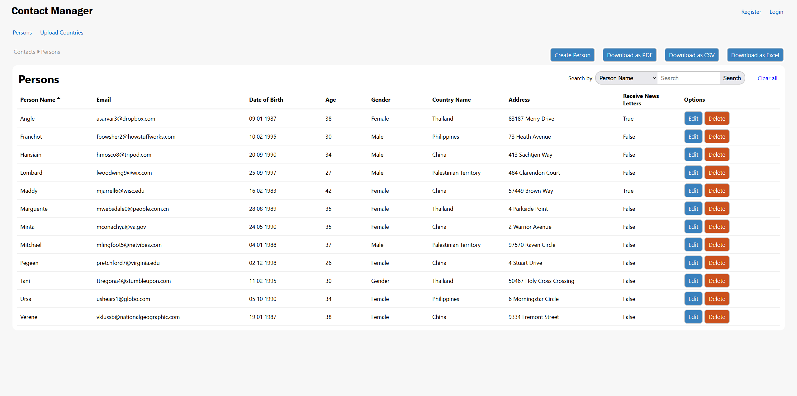
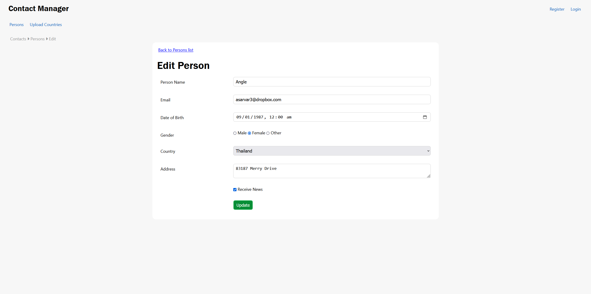
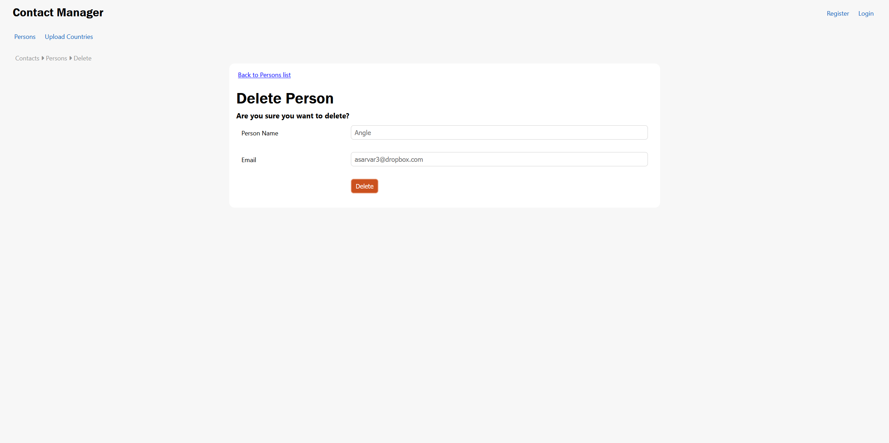
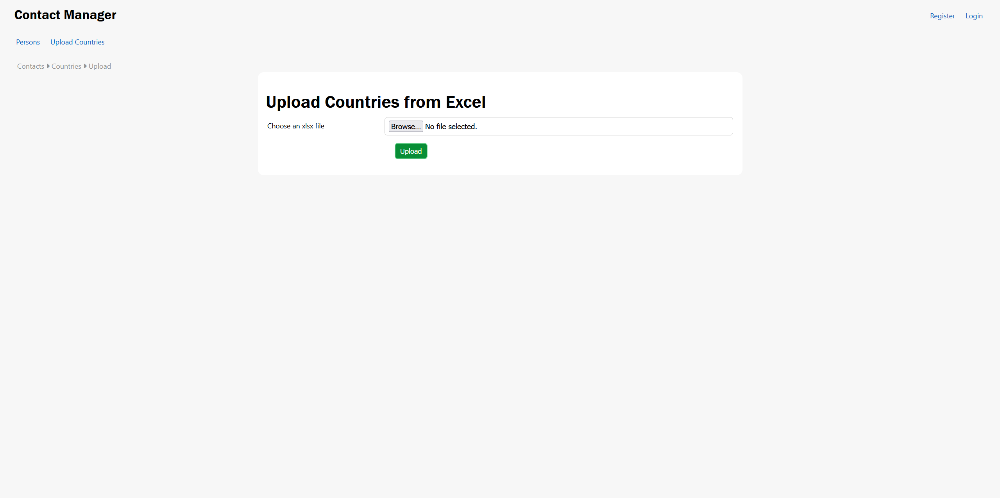
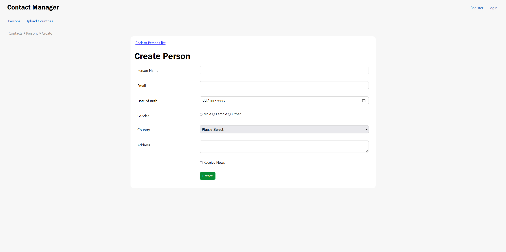

# CRUDExample

This is a simple ASP.NET Core application that demonstrates the implementation of CRUD (Create, Read, Update, Delete) operations with proper use of filters, dependency injection, and service configuration.

## Snippets of the Running Application
### Example:

## Technologies Used

- **ASP.NET Core**
- **Entity Framework Core**
- **SQL Server**
- **Dependency Injection**
- **Custom Filters**
- **HTTP Logging**
